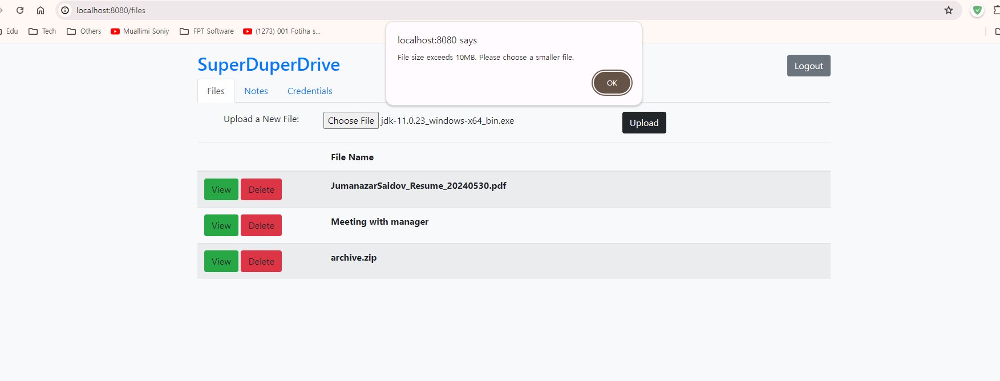
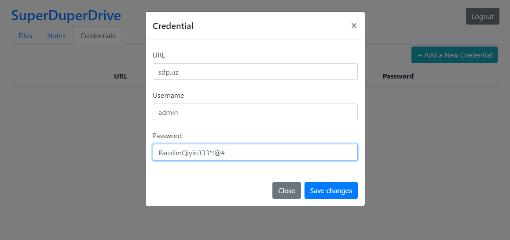

# Super*Duper*Drive Cloud Storage
You have been hired by Super*Duper*Drive, which is a brand new company aiming to make a dent in the Cloud Storage market and is already facing stiff competition from rivals like Google Drive and Dropbox. That hasn't dampened their spirits at all, however. They want to include personal information management features in their application to differentiate them from the competition, and the minimum viable product includes three user-facing features:

1. **Simple File Storage:** Upload/download/remove files
2. **Note Management:** Add/update/remove text notes
3. **Password Management:** Save, edit, and delete website credentials.  

Super*Duper*Drive wants you to focus on building the web application with the skills you acquired in this course. That means you are responsible for developing the server, website, and tests, but other tasks like deployment belong to other teams at the company. 

## Starter Project
A senior developer is assigned to be your tech lead and mentor, and they put together a starter project for you. It's a Maven project configured for all the dependencies the project requires, though you should feel free to add any additional dependencies you might require. [You can download or clone the starter repository here](https://github.com/udacity/nd035-c1-spring-boot-basics-project-starter/tree/master/starter/cloudstorage).

Your tech lead already designed a database schema for the project and has added it to the `src/main/resources` directory. That means you don't have to design the database, only develop the Java code to interact with it. 

Your tech lead also created some HTML templates from the design team's website mockups, and they placed them in the `src/main/resources/templates` folder. These are static pages right now, and you have to configure them with Thymeleaf to add functionality and real data from the server you develop. You may also have to change them to support testing the application.

From the link above, you can download the starter code and open it as a Maven project in IntelliJ.

## Requirements and Roadmap
Your tech lead is excited to work with you and has laid out a development roadmap with requirements and milestones. They tell you that there are three layers of the application you need to implement:

1. The back-end with Spring Boot
2. The front-end with Thymeleaf
3. Application tests with Selenium

### The Back-End
The back-end is all about security and connecting the front-end to database data and actions. 

1. Managing user access with Spring Security
- [x] You have to restrict unauthorized users from accessing pages other than the login and signup pages. To do this, you must create a security configuration class that extends the `WebSecurityConfigurerAdapter` class from Spring. Place this class in a package reserved for security and configuration. Often this package is called `security` or `config`.
- [x] Spring Boot has built-in support for handling calls to the `/login` and `/logout` endpoints. You have to use the security configuration to override the default login page with one of your own, discussed in the front-end section.
- [x] You also need to implement a custom `AuthenticationProvider` which authorizes user logins by matching their credentials against those stored in the database.  


2. Handling front-end calls with controllers
 - [x] You need to write controllers for the application that bind application data and functionality to the front-end. That means using Spring MVC's application model to identify the templates served for different requests and populating the view model with data needed by the template. 
 - [x] The controllers you write should also be responsible for determining what, if any, error messages the application displays to the user. When a controller processes front-end requests, it should delegate the individual steps and logic of those requests to other services in the application, but it should interpret the results to ensure a smooth user experience.
 - [x] It's a good idea to keep your controllers in a single package to isolate the controller layer. Usually, we simply call this package `controller`!
 - [x] If you find yourself repeating tasks over and over again in controller methods, or your controller methods are getting long and complicated, consider abstracting some methods out into services! For example, consider the `HashService` and `EncryptionService` classes included in the starter code package `service`. These classes encapsulate simple, repetitive tasks and are available anywhere dependency injection is supported. Think about additional tasks that can be similarly abstracted and reused, and create new services to support them!


3. Making calls to the database with MyBatis mappers
 - [x] Since you were provided with a database schema to work with, you can design Java classes to match the data in the database. These should be POJOs (Plain Old Java Objects) with fields that match the names and data types in the schema, and you should create one class per database table. These classes typically are placed in a `model` or `entity` package.
 - [x] To connect these model classes with database data, implement MyBatis mapper interfaces for each of the model types. These mappers should have methods that represent specific SQL queries and statements required by the functionality of the application. They should support the basic CRUD (Create, Read, Update, Delete) operations for their respective models at the very least. You can place these classes in (you guessed it!) the `mapper` package.


### The Front-End
Your tech lead has done a thorough job developing HTML templates for the required application pages. They have included fields, modal forms, success and error message elements, as well as styling and functional components using Bootstrap as a framework. You must edit these templates and insert Thymeleaf attributes to supply the back-end data and functionality described by the following individual page requirements:

1. Login page
 - [x] Everyone should be allowed access to this page, and users can use this page to login to the application. 
 - [x] Show login errors, like invalid username/password, on this page. 


2. Sign Up page
 - [x] Everyone should be allowed access to this page, and potential users can use this page to sign up for a new account. 
 - [x] Validate that the username supplied does not already exist in the application, and show such signup errors on the page when they arise.
 - [x] Remember to store the user's password securely!


3. Home page
- [x] The home page is the center of the application and hosts the three required pieces of functionality. The existing template presents them as three tabs that can be clicked through by the user:


 i. Files
  - [x] The user should be able to upload files and see any files they previously uploaded.
  - [x] The user should be able to view/download or delete previously-uploaded files.
  - [x] Any errors related to file actions should be displayed. For example, a user should not be able to upload two files with the same name, but they'll never know unless you tell them!


 ii. Notes
  - [x] The user should be able to create notes and see a list of the notes they have previously created.
  - [x] The user should be able to edit or delete previously-created notes.

 iii. Credentials
 - [x] The user should be able to store credentials for specific websites and see a list of the credentials they've previously stored. If you display passwords in this list, make sure they're encrypted!
 - [x] The user should be able to view/edit or delete individual credentials. When the user views the credential, they should be able to see the unencrypted password.
 
 - [x] The home page should have a logout button that allows the user to logout of the application and keep their data private.

### Testing
- Your tech lead trusts you to do a good job, but testing is important whether you're an excel number-cruncher or a full-stack coding superstar! The QA team at Super*Duper*Drive carries out extensive user testing. Still, your tech lead wants you to write some simple Selenium tests to verify user-facing functionality and prove that your code is feature-complete before the testers get their hands on it.

1. Write tests for user signup, login, and unauthorized access restrictions.
 - [x] Write a test that verifies that an unauthorized user can only access the login and signup pages.
 - [x] Write a test that signs up a new user, logs in, verifies that the home page is accessible, logs out, and verifies that the home page is no longer accessible. 


2. Write tests for note creation, viewing, editing, and deletion.
 - [x] Write a test that creates a note, and verifies it is displayed.
 - [x] Write a test that edits an existing note and verifies that the changes are displayed.
 - [x] Write a test that deletes a note and verifies that the note is no longer displayed.


3. Write tests for credential creation, viewing, editing, and deletion.
 - [x] Write a test that creates a set of credentials, verifies that they are displayed, and verifies that the displayed password is encrypted.
 - [x] Write a test that views an existing set of credentials, verifies that the viewable password is unencrypted, edits the credentials, and verifies that the changes are displayed.
 - [x] Write a test that deletes an existing set of credentials and verifies that the credentials are no longer displayed.

## Final Tips and Tricks
### Password Security
- [x] Make sure not to save the plain text credentials of the application's users in the database. That's a recipe for data breach disaster! Use a hashing function to store a scrambled version instead. Your tech lead gave you a class called `HashService` that can hash passwords for you. When the user signs up, you only store a hashed version of their password in the database, and on login, you hash the password attempt before comparing it with the hashed password in the database. Your tech lead knows that can be a little confusing, so they provided this code sample to help illustrate the idea:

```
byte[] salt = new byte[16];
random.nextBytes(salt);
String encodedSalt = Base64.getEncoder().encodeToString(salt);
String hashedPassword = hashService.getHashedValue(plainPassword, encodedSalt);
return hashedPassword;
```

- [x] For storing credentials in the main part of the application, we can't hash passwords because it's a one-way operation. The user needs access to the unhashed password, after all! So instead, you should encrypt the passwords. Your tech lead provided you with a class called `EncryptionService` that can encrypt and decrypt passwords. When a user adds new credentials, encrypt the password before storing it in the database. When the user views those credentials, decrypt the password before displaying it. Here's a little code snippet on how to use `EncryptionService`:

```
SecureRandom random = new SecureRandom();
byte[] key = new byte[16];
random.nextBytes(key);
String encodedKey = Base64.getEncoder().encodeToString(key);
String encryptedPassword = encryptionService.encryptValue(password, encodedKey);
String decryptedPassword = encryptionService.decryptValue(encryptedPassword, encodedKey);
```

You aren't required to understand hashing or encryption and that's why your tech lead provided these code samples for you. If you're curious and want to learn a little more, you can do a quick Google search or follow the links below:

[Hash Function](https://en.wikipedia.org/wiki/Hash_function)
[Encryption](https://en.wikipedia.org/wiki/Encryption)

All of us here at Super*Duper*Drive wish you good luck with the project!


## Some use cases with screenshots
- Validation in action



- Credential input process


- Credential view with encrypted password


